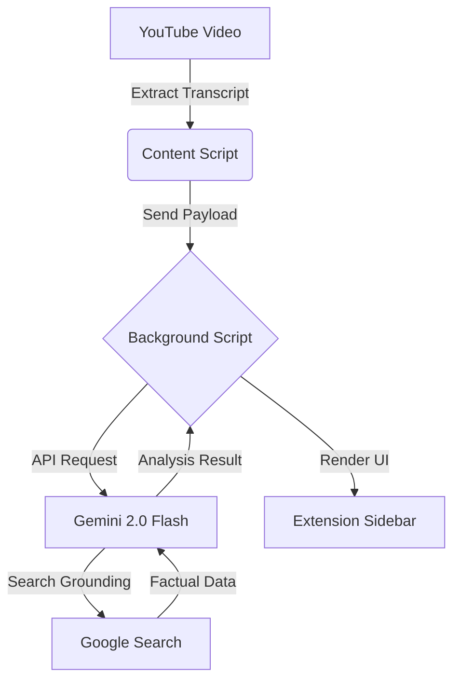

# 📑 factcheck

[](LICENSE)
[](https://github.com/humanchaos/factcheck/graphs/commit-activity)
[](http://makeapullrequest.com)
[](https://www.buymeacoffee.com/humanchaos)

**Protecting the truth in the digital age.**

> Because "Trust me, bro" isn't a valid source for a healthy democracy.

**factcheck** is an open-source Chrome Extension designed to automate the verification of claims made in YouTube videos — in real-time. In an era of rampant misinformation, we aim to provide journalists, researchers, and citizens with the technical infrastructure to cross-reference statements against reliable data sources as they watch.

---

## 🗳️ Why This Matters

Our democracy relies on a shared reality. When misinformation spreads faster than the truth, the foundation of public discourse weakens. This tool is built to:

- **Empower Journalists:** Rapidly verify data points during live events and video content.
- **Reduce Bias:** Use algorithmic cross-referencing to highlight factual inconsistencies.
- **Scale Truth:** Fact-checking humans can't keep up with bot-generated lies; we need code to fight back.

---

## 🚀 Quick Start

### Prerequisites

- Google Chrome (or Chromium-based browser)
- A free [Gemini API Key](https://aistudio.google.com/app/apikey)

### Installation

```bash
# Clone the repository
git clone https://github.com/humanchaos/factcheck.git
cd factcheck
```

1. Open Chrome and go to `chrome://extensions`
2. Enable **Developer mode** (top right)
3. Click **Load unpacked**
4. Select the cloned `factcheck` folder

### Configuration

1. Click the **FAKTCHECK** icon in your Chrome toolbar
2. Paste your Gemini API key
3. Click **Save Settings**

### Usage

1. Open any YouTube video
2. Click the **📋 FAKTCHECK** button below the video
3. Watch claims get extracted and verified in real-time

---

## 🛠️ Tech Stack & Architecture

| Component | Technology |
|-----------|------------|
| Platform | Chrome Extension (Manifest V3) |
| AI Engine | Google Gemini 2.0 Flash |
| Grounding | Google Search (via Gemini) |
| Security | XSS protection, input sanitization, rate limiting |
| Languages | JavaScript, HTML, CSS |

### How It Works

1. **Extract** — Transcripts or live captions are captured from YouTube
2. **Analyze** — Gemini identifies verifiable claims and assigns checkability scores
3. **Verify** — Each claim is cross-referenced using Google Search grounding
4. **Display** — Results appear in a real-time sidebar with verdict, sources, and confidence



### Source Tiers

| Tier | Icon | Examples |
|------|------|----------|
| 1 | 🥇 | Official statistics, government docs, parliamentary records |
| 2 | 🥈 | Quality journalism (APA, Reuters, ORF, BBC, NYT) |
| 3 | 🥉 | Fact-checkers (Mimikama, Snopes, Wikipedia) |
| 4 | 📄 | Other sources |

---

## 🗺️ Community Roadmap

This project is in its early **Alpha** stage. The goal is to move from "Messy Prototype" to a "Robust Public Utility." Every [☕ coffee](https://www.buymeacoffee.com/humanchaos) or [💖 sponsorship](https://github.com/sponsors/humanchaos) directly accelerates these milestones.

### 🟢 Phase 1: The Foundation (Current Focus)

- **Infrastructure Audit** — Standardize code structure and fix security gaps identified during launch
- **API Resilience** — Better error handling for Gemini rate limits to prevent extension crashes
- **Multi-Language Support** — ✅ Done! UI now supports 6 languages (DE, EN, FR, ES, IT, PT) with auto-detection
- **Manual Onboarding** — Clearer docs for developers to set up local dev environments

### 🟡 Phase 2: User Friction & Performance (Next)

- **The "API Key" Solution** — Explore [Transformers.js](https://huggingface.co/docs/transformers.js) for local, on-device processing to remove the API key requirement
- **Real-time Optimization** — Reduce CPU usage when parsing YouTube transcripts so the extension doesn't lag the video
- **UI/UX Overhaul** — Move from a developer's UI to a clean, accessible interface that anyone can understand

### 🔵 Phase 3: The Trust Engine (Future)

- **Weighted Consensus** — Develop an algorithmic model to weight sources based on international standards ([IFCN](https://www.ifcncodeofprinciples.poynter.org/))
- **Cross-Platform Support** — Expand beyond YouTube to verify claims on Twitter (X), Reddit, and news sites
- **Community Verification** — Allow trusted human contributors to flag AI hallucinations and improve accuracy over time

---

## 🔒 Privacy

- Your API key is stored **locally** in your browser (never synced or transmitted)
- **No user tracking** or analytics
- Video content is only sent to the Gemini API for analysis
- Nothing is stored permanently

---

## 🤝 Contributing

We love Pull Requests!

1. Fork the repo.
2. Create your feature branch (`git checkout -b feature/AmazingFeature`).
3. Commit your changes (`git commit -m 'Add AmazingFeature'`).
4. Push to the branch (`git push origin feature/AmazingFeature`).
5. Open a Pull Request.

---

## ☕ Support the Mission

If **factcheck** helps you navigate online information, consider supporting its development. Every coffee fuels the "Trust Engine" and helps us keep the project open-source and ad-free.

[](https://www.buymeacoffee.com/humanchaos)

You can also [💖 sponsor on GitHub](https://github.com/sponsors/humanchaos) for recurring support.

<!-- sponsors -->
<!-- sponsors -->

*Early sponsors will be featured here. Thank you for fueling the fight against misinformation.*

## ⚖️ License

Distributed under the MIT License. See [LICENSE](LICENSE) for more information.

---

Made for democratic transparency 🇦🇹

