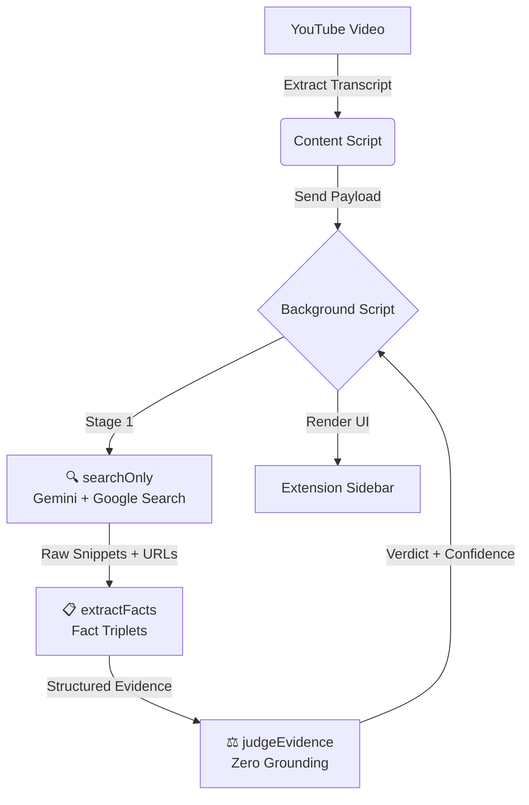

# 📑 factcheck

[](LICENSE)
[](https://github.com/humanchaos/factcheck/graphs/commit-activity)
[](http://makeapullrequest.com)
[](https://www.buymeacoffee.com/humanchaos)

**Protecting the truth in the digital age.**

> Because "Trust me, bro" isn't a valid source for a healthy democracy.

**factcheck** is an open-source Chrome Extension designed to automate the verification of claims made in YouTube videos — in real-time. In an era of rampant misinformation, we aim to provide journalists, researchers, and citizens with the technical infrastructure to cross-reference statements against reliable data sources as they watch.

---

## 🗳️ Why This Matters

Our democracy relies on a shared reality. When misinformation spreads faster than the truth, the foundation of public discourse weakens. This tool is built to:

- **Empower Journalists:** Rapidly verify data points during live events and video content.
- **Reduce Bias:** Use algorithmic cross-referencing to highlight factual inconsistencies.
- **Scale Truth:** Fact-checking humans can't keep up with bot-generated lies; we need code to fight back.

---

## 🚀 Quick Start

### Prerequisites

- Google Chrome (or Chromium-based browser)
- A free [Gemini API Key](https://aistudio.google.com/app/apikey)

### Installation

```bash
# Clone the repository
git clone https://github.com/humanchaos/factcheck.git
cd factcheck
```

1. Open Chrome and go to `chrome://extensions`
2. Enable **Developer mode** (top right)
3. Click **Load unpacked**
4. Select the cloned `factcheck` folder

### Configuration

1. Click the **FAKTCHECK** icon in your Chrome toolbar
2. Paste your Gemini API key
3. Click **Save Settings**

### Usage

1. Open any YouTube video
2. Click the **📋 FAKTCHECK** button below the video
3. Watch claims get extracted and verified in real-time

---

## 🛠️ Tech Stack & Architecture

| Component | Technology |
|-----------|------------|
| Platform | Chrome Extension (Manifest V3) |
| AI Engine | Google Gemini 2.0 Flash |
| Grounding | Google Search (via Gemini) |
| Security | XSS protection, input sanitization, rate limiting |
| Languages | JavaScript, HTML, CSS |

### How It Works — Three-Stage Verification Pipeline

Every claim goes through a **Separation of Powers** pipeline where no single AI call can both find evidence *and* render a verdict:

1. **🔍 Search** (`searchOnly`) — Gemini + Google Search finds raw evidence snippets and source URLs. No verdict is issued.
2. **📋 Extract** (`extractFacts`) — A second Gemini call decomposes snippets into structured **Fact Triplets** (Subject → Relation → Object), each tagged as `supporting`, `contradicting`, or `nuanced`.
3. **⚖️ Judge** (`judgeEvidence`) — A third Gemini call (zero grounding) renders a verdict based *only* on the extracted facts. Includes a **Mathematical Outlier** guardrail: if a claim's number exceeds evidence by >10×, it returns `FALSE`.



### Domain-Aware Source Authority

Sources are tiered using a [registry of 41+ domains](assets/registry/sources-global.json) with wildcard support:

| Tier | Icon | Category | Examples |
|------|------|----------|----------|
| 1 | 🏛️ | Official / Authority | Government (.gov, .gv.at), UN, WHO |
| 1 | 🌍 | Wire Agencies | Reuters, AP, AFP, APA |
| 2 | 📰 | Public Broadcasters | BBC, ORF, Tagesschau |
| 2 | 📡 | News of Record | NYT, Der Standard, Die Presse |
| 3 | ✅ | Fact-Checkers | Snopes, PolitiFact, Mimikama |
| 4 | 📄 | General / Unclassified | Unknown domains |
| 5 | ⚠️ | Unreliable | RT, InfoWars, Sputnik |

Confidence is calculated deterministically: `Confidence = Base × SourceTier × Agreement` — no LLM "feelings."

### Evidence Chain & Debate Mode

Every claim card expands to show a full **Evidence Chain**:
- **Tier badge** with domain-aware icon (🏛️, 📰, 🔬, etc.)
- **Smoking gun quote** from the source, or a fallback message if none exists
- **Debate Mode**: When evidence conflicts, a 🟢/🔴 split view shows *Supporting* vs. *Contradicting* facts

---

## 🗺️ Community Roadmap

This project is in its early **Alpha** stage. The goal is to move from "Messy Prototype" to a "Robust Public Utility." Every [☕ coffee](https://www.buymeacoffee.com/humanchaos) or [💖 sponsorship](https://github.com/sponsors/humanchaos) directly accelerates these milestones.

### 🟢 Phase 1: The Foundation ✅ Complete

- **Three-Stage Verification Pipeline** — Separation of Powers: no single AI call does retrieval + judgment
- **Domain-Aware Source Registry** — 41+ domains with wildcard support and deterministic confidence scoring
- **Evidence Chain UI** — Expandable proof cards with tier badges, quotes, and verification links
- **Multi-Language Support** — UI in 6 languages (DE, EN, FR, ES, IT, PT) with auto-detection
- **Community Governance** — Code of Conduct, Security Policy, Privacy Policy, Trust Policy

### 🟡 Phase 2: Trust Intelligence (Current Focus)

- **Debate Mode** — ✅ Done! Green/red split view when evidence conflicts
- **Fact Triplets** — ✅ Done! Structured evidence extraction with sentiment classification
- **Source Click Tracking** — ✅ Done! Local analytics for source interaction patterns
- **Source Decay** — Dynamic credibility weighting based on user feedback (next)
- **Real-time Optimization** — Reduce CPU usage during transcript parsing

### 🔵 Phase 3: The Trust Engine (Future)

- **Weighted Consensus** — Algorithmic source weighting based on international standards ([IFCN](https://www.ifcncodeofprinciples.poynter.org/))
- **Cross-Platform Support** — Expand beyond YouTube to Twitter (X), Reddit, and news sites
- **Community Verification** — Allow trusted human contributors to flag AI hallucinations

---

## 🔒 Privacy

- Your API key is stored **locally** in your browser (never synced or transmitted)
- **No user tracking** or analytics — source click data stays on your device
- Video content is only sent to the Gemini API for analysis
- Nothing is stored permanently

---

## 🤝 Contributing

We love Pull Requests!

1. Fork the repo.
2. Create your feature branch (`git checkout -b feature/AmazingFeature`).
3. Commit your changes (`git commit -m 'Add AmazingFeature'`).
4. Push to the branch (`git push origin feature/AmazingFeature`).
5. Open a Pull Request.

---

## ☕ Support the Mission

If **factcheck** helps you navigate online information, consider supporting its development. Every coffee fuels the "Trust Engine" and helps us keep the project open-source and ad-free.

[](https://www.buymeacoffee.com/humanchaos)

You can also [💖 sponsor on GitHub](https://github.com/sponsors/humanchaos) for recurring support.

<!-- sponsors -->
<!-- sponsors -->

*Early sponsors will be featured here. Thank you for fueling the fight against misinformation.*

## ⚖️ License

Distributed under the MIT License. See [LICENSE](LICENSE) for more information.

---

Made for democratic transparency 🇦🇹

