# 📑 FAKTCHECK LIVE

[](LICENSE)
[](CHANGELOG.md)
[](https://github.com/humanchaos/factcheck/graphs/commit-activity)
[](http://makeapullrequest.com)
[-brightgreen.svg)](TESTING.md)
[](https://www.buymeacoffee.com/humanchaos)

**Protecting the truth in the digital age.**

> Because "Trust me, bro" isn't a valid source for a healthy democracy.

**factcheck** is an open-source Chrome Extension designed to automate the verification of claims made in YouTube videos — in real-time. In an era of rampant misinformation, we aim to provide journalists, researchers, and citizens with the technical infrastructure to cross-reference statements against reliable data sources as they watch.

---

## 🗳️ Why This Matters

Our democracy relies on a shared reality. When misinformation spreads faster than the truth, the foundation of public discourse weakens. This tool is built to:

- **Empower Journalists:** Rapidly verify data points during live events and video content.
- **Reduce Bias:** Use algorithmic cross-referencing to highlight factual inconsistencies.
- **Scale Truth:** Fact-checking humans can't keep up with bot-generated lies; we need code to fight back.

---

## 🚀 Quick Start

### Prerequisites

- Google Chrome (or Chromium-based browser)
- A free [Gemini API Key](https://aistudio.google.com/app/apikey)

### Installation

```bash
# Clone the repository
git clone https://github.com/humanchaos/factcheck.git
cd factcheck
```

1. Open Chrome and go to `chrome://extensions`
2. Enable **Developer mode** (top right)
3. Click **Load unpacked**
4. Select the cloned `factcheck` folder

### Configuration

1. Click the **FAKTCHECK** icon in your Chrome toolbar
2. Paste your Gemini API key
3. Click **Save Settings**

### Usage

1. Open any YouTube video
2. Click the **📋 FAKTCHECK** button below the video
3. Watch claims get extracted and verified in real-time

---

## 🛠️ Tech Stack & Architecture

| Component | Technology |
|-----------|------------|
| Platform | Chrome Extension (Manifest V3) |
| AI Engine | Google Gemini 2.0 Flash |
| Grounding | Google Search (via Gemini) |
| Structured Data | Wikidata API, Eurostat JSON API |
| Security | XSS protection, input sanitization, rate limiting |
| Languages | JavaScript, HTML, CSS |

### How It Works — 4-Tier Verification Pipeline

Every claim goes through a **hierarchical verification cascade** where each tier only fires if the previous one didn't resolve the claim. No single AI call can both find evidence *and* render a verdict (**Separation of Powers**).

| Tier | Function | Source | Cost |
|------|----------|--------|------|
| **Tier 0** | `searchFactChecks()` | Google Fact Check Tools API | Free |
| **Tier 1A** | `queryWikidata()` | Wikidata Entity API | Free |
| **Tier 1B** | `queryEurostat()` | Eurostat JSON API | Free |
| **Tier 2** | `searchOnly()` | Gemini + Google Search | 1 API call |
| **Local** | `mapEvidence()` | Maps groundingSupports → URLs | Zero cost |
| **Judge** | `judgeEvidence()` | Gemini JSON mode (no search) | 1 API call |

```mermaid
graph TD
    A["YouTube Video"] -->|Extract Transcript| B("Content Script")
    B -->|Send Payload| C{"Background Script"}
    C -->|Tier 0| D["🏆 searchFactChecks<br/>Fact Check Tools API"]
    D -->|No match| E["🏛️ Tier 1A: queryWikidata<br/>Entity Hydration"]
    E --> F["📊 Tier 1B: queryEurostat<br/>Statistical Data"]
    F --> G["🔍 Tier 2: searchOnly<br/>Gemini + Google Search"]
    G -->|Raw Snippets + URLs| H["📋 mapEvidence (LOCAL)<br/>Attribute Quotes to URLs"]
    H -->|Attributed Evidence| I["⚖️ judgeEvidence<br/>JSON Mode, Zero Grounding"]
    I -->|Structured JSON| C
    C -->|Render UI| J["Extension Sidebar"]
    D -->|Match found| C
```



### 🛡️ v5.4 — "The Ground Truth"

The latest pipeline hardening focuses on separating **facts from propaganda** and ensuring **external reality** always wins over speaker assertion.

#### Stage 2: Semantic Core Extraction

Every claim passes through **3 processing steps** before verification:

| Step | What It Does | Example |
|------|--------------|---------|
| **Semantic Stripping** | Removes attribution shells | "Laut FPÖ TV liegt Österreich auf Platz 185" → "Österreich auf Platz 185" |
| **Entity Hydration** | Resolves names from context | "Stocker" → "Christian Stocker" |
| **Atomisierung** | One fact per entry, opinions separated | `type: "opinion"` for non-verifiable statements |

`stripAttribution()` provides a **code-level guarantee** with 11 regex patterns (8 DE + 3 EN), validated at 10/10 (100%).

#### Stage 3: Reality-First Judging

The judge operates under **BEWERTUNGS-LOGIK** — 8 rules that ensure external reality always overrides video assertions:

| Rule | Effect |
|------|--------|
| **Realitäts-Primat** | Video ≠ evidence. Only external data counts. |
| **Tier-1 Dominanz** | WIFO/IMF/Eurostat override speaker claims |
| **Confidence Formula** | `min(0.95, Σ(S_i × W_i) × V_c)` — deterministic, per-source scoring |
| **Source Sanitization** | YouTube + Wikipedia filtered from confidence and source lists |
| **Metaphern-Erkennung** | Political exaggerations checked against real data |
| **ABSCHLUSS-PRÜFUNG** | "Is there official data contradicting this core claim?" |

### 🛡️ Math Guardrail

LLMs hallucinate with large numbers. FAKTCHECK includes a **code-level safeguard** that fires before any AI verdict:

> **Rule:** If the claimed value exceeds the evidence value by **≥ 10×** (or ≤ 0.1×), the system automatically overrides the verdict to `FALSE` and sets `math_outlier: true`.

| Claim | Evidence | Ratio | Result |
|-------|----------|-------|--------|
| "US tariff revenue is $18 trillion" | ~$80 billion | 225× | ❌ `FALSE` — Math Outlier |
| "Austria's GDP grows 5%" | WIFO: 1.2% | 4.2× | Passes to judge |

When triggered, the UI shows an orange/red **⚠️ Mathematically Implausible** warning card.

### 🔎 Interactive Evidence Chain

Every claim card expands to show a full **Evidence Chain** with progressive disclosure:

- **🏆 Professional Fact-Checks** — Results from Tier 0 (Google Fact Check Tools API)
- **Tier badge** with domain-aware icon (🏛️ Gov, 📰 PSB, 🔬 Science, ✅ Fact-Check)
- **Attributed quotes** — Exact sentences mapped to source URLs (hallucination-proof)
- **Debate Mode** — When evidence conflicts, a 🟢/🔴 split shows *Supporting* vs. *Contradicting* quotes
- **Feedback** — 👍/👎 per claim + 🚩 Source Report per quote
- **Verification links** — Every source opens in a new tab (`target="_blank"`)

---

### Domain-Aware Source Authority

Sources are tiered using a [registry of 57+ domains](assets/registry/sources-global.json) with wildcard support:

| Tier | Icon | Category | Examples |
|------|------|----------|----------|
| 1 | 🏛️ | Official / Authority | Government (.gov, .gv.at), UN, WHO |
| 1 | 🌍 | Wire Agencies | Reuters, AP, AFP, APA |
| 2 | 📰 | Public Broadcasters | BBC, ORF, Tagesschau |
| 2 | 📡 | News of Record | NYT, Der Standard, Die Presse |
| 3 | ✅ | Fact-Checkers | Snopes, PolitiFact, Mimikama |
| 4 | 📄 | General / Unclassified | Unknown domains |
| 5 | ⚠️ | Unreliable | RT, InfoWars, Sputnik |

Confidence is calculated deterministically: `Confidence = Base × SourceTier × Agreement` — no LLM "feelings."

For the complete API schema including JSON output format and tier definitions, see **[API_SPEC.md](API_SPEC.md)**.

---

## 🧪 Testing

FAKTCHECK uses a **22 Golden Test** suite that must pass before any release. The **Assessment Ratio** (≥90%) is our Definition of Done.

```bash
# Golden Tests
GEMINI_API_KEY=AIza... node test-dryrun.js

# Stage 2 Stripping Validation
node test-stage2-validation.js
```

Current status: **22/22 (100%)** — see [TESTING.md](TESTING.md) for the full test matrix, pass criteria, and kill switch rules.

---

## 🗺️ Community Roadmap

### 🟢 Phase 1: The Foundation ✅

- Three-Stage Verification Pipeline — Separation of Powers
- Domain-Aware Source Registry — 57+ domains, deterministic confidence
- Multi-Language Support — 6 languages with auto-detection
- Community Governance — Code of Conduct, Security, Privacy, Trust Policy

### 🟢 Phase 2: Trust Intelligence ✅ (v2.0.0 → v2.1.0)

- **4-Tier Pipeline** — Professional fact-checks → Wikidata → Eurostat → Gemini Search
- **Interactive Evidence Chain** — Accordion UI with attributed quotes, tier badges, verification links
- **Structured JSON Judge** — `response_mime_type: application/json` eliminates regex parsing
- **Math Guardrail** — 10× outlier rule with UI warning card
- **Debate Mode** — 🟢/🔴 split view for conflicting evidence
- **Feedback System** — 👍/👎 + 🚩 Source Report per quote
- **v5.4 "The Ground Truth"** — Semantic Stripping, Entity Hydration, Reality-First Judging
- **22 Golden Tests** — 100% pass rate, automated stability checks

### 🟡 Phase 3: The Trust Engine (Next)

- **Source Decay** — Dynamic credibility weighting based on user feedback
- **Weighted Consensus** — Algorithmic weighting based on [IFCN](https://www.ifcncodeofprinciples.poynter.org/) standards
- **Cross-Platform** — Expand beyond YouTube to Twitter (X), Reddit, news sites
- **Community Verification** — Trusted human contributors flag AI hallucinations

---

## 🔒 Privacy

- Your API key is stored **locally** in your browser (never synced or transmitted)
- **No user tracking** or analytics — source click data stays on your device
- Video content is only sent to the Gemini API for analysis
- Nothing is stored permanently

---

## 🤝 Contributing

We love Pull Requests!

1. Fork the repo.
2. Create your feature branch (`git checkout -b feature/AmazingFeature`).
3. Commit your changes (`git commit -m 'Add AmazingFeature'`).
4. Push to the branch (`git push origin feature/AmazingFeature`).
5. Open a Pull Request.

---

## ☕ Support the Mission

If **factcheck** helps you navigate online information, consider supporting its development. Every coffee fuels the "Trust Engine" and helps us keep the project open-source and ad-free.

[](https://www.buymeacoffee.com/humanchaos)

You can also [💖 sponsor on GitHub](https://github.com/sponsors/humanchaos) for recurring support.

<!-- sponsors -->
<!-- sponsors -->

*Early sponsors will be featured here. Thank you for fueling the fight against misinformation.*

## ⚖️ License

Distributed under the MIT License. See [LICENSE](LICENSE) for more information.

---

Made for democratic transparency 🇦🇹

